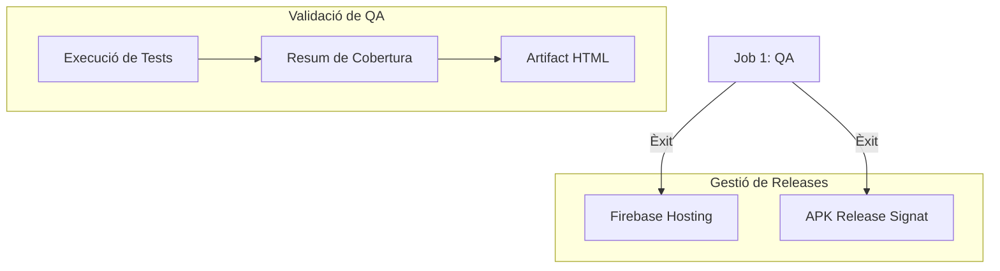

# 🚀 MPOP2 - Pt3: Pipeline d'Entrega Professional

[](https://github.com/pcodorniu/MPOP2-Pt3)
[](https://github.com/pcodorniu/MPOP2-Pt3/actions)
[](https://prova-2df62.web.app)

Benvinguts a l'evolució de la **Pt3** de l'aplicació de gestió de productes. Aquest projecte demostra una integració de nivell professional entre l'**Automatització de QA**, el **CI/CD Multiplataforma** i la **Gestió Segura de Releases**.

---

## 🏗️ Arquitectura: Flutter + Supabase

L'aplicació segueix una arquitectura neta **MVVM (Model-View-ViewModel)**, garantint una separació estricta entre la interfície i la lògica de negoci, fet que facilita el testeig i el manteniment.

### Components clau:
- **Presentation**: Vistes de pantalla (`lib/presentation/screens`) i ViewModels (`lib/presentation/*.vm.dart`) que implementen la lògica.
- **Data Layer**: Repositoris per a l'abstracció i Serveis per comunicar-se amb l'**API de Supabase**.
- **Gestió d'Estat**: Ús de `Provider` per a les actualitzacions reactives de la UI i la injecció de dependències.

> [!NOTE]  
> L'arquitectura està dissenyada per ser **agnòstica de Supabase** a nivell de ViewModel, permetent canviar el backend fàcilment substituint les implementacions dels serveis.

---

## 🧪 Estratègia de QA i Tests d'Integració

El projecte implementa una suite de qualitat robusta que assoleix una **cobertura del 83.7%** en les capes crítiques (Screens, ViewModels i Repositoris).

### 🔍 Verificació Unívoca
Cada prova està dissenyada per validar **dades úniques** injectades mitjançant Mocks. Evitem cerques de text genèriques, assegurant que:
1. Injectem objectes concrets (ex: `New Gadget`, `49.99`).
2. Verifiquem que apareixen *exactament* aquestes cadenes a la pantalla després de la interacció.
3. Confirmem que el repositori ha rebut l'objecte modificat *correcte* mitjançant `verify(...)`.

### 🛠️ Execució i Informes
Per executar els tests localment i generar l'informe de cobertura:

```bash
# Executar tots els tests amb cobertura
flutter test --coverage

# Generar informe HTML (requereix lcov)
genhtml coverage/lcov.info -o coverage/html
```

---

## ⚙️ Pipeline de CI/CD (GitHub Actions)

El projecte utilitza un pipeline estructurat amb **3 jobs dependents**, garantint que cap desplegament s'efectuï sense passar els controls de qualitat.



### Funcions del Pipeline:
1.  **QA (Quality Assurance)**: Executa els tests, genera un resum Markdown al Job Summary i puja un artifact HTML amb la cobertura.
2.  **Deploy Web**: Construeix i publica automàticament la darrera versió a **Firebase Hosting**.
3.  **Build Android**: Genera un **APK Release signat** utilitzant secrets segurs per al Keystore.

---

## 📦 Accés a les Versions

### 🌐 Entorn Web
La darrera versió es desplega automàticament i és accessible aquí:
👉 **[Demo en viu a Firebase Hosting](https://prova-2df62.web.app)**

### 📱 Android APK
L'APK signat està disponible com a **Artifact** a l'execució de GitHub Actions:
1. Ves a la pestanya [Actions](https://github.com/pcodorniu/MPOP2-Pt3/actions).
2. Selecciona la darrera execució amb èxit del workflow.
3. Baixa fins a la secció **Artifacts** i descarrega `release-apk`.

---

## 🔗 Enllaços de Lliurament

Podeu accedir a tot el material del projecte mitjançant els següents enllaços:

- **Repositori GitHub**: [GitHub - MPOP2-Pt3](https://github.com/pcodorniu/MPOP2-Pt3)
- **Vídeo de la Defensa**: [Enllaç al vídeo de la defensa](https://youtu.be/oPr74EjlneQ)

---

Desenvolupat per **Pau Codorniu** | 2026 🎓
